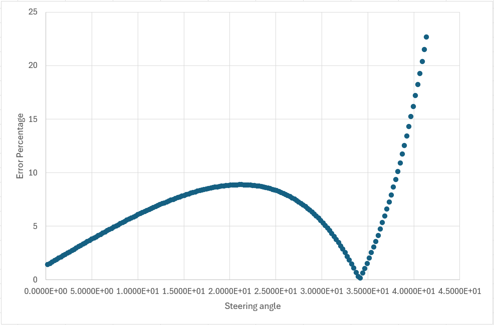

# Ackermann Steering Design (SolidWorks + Python Analysis)

This repository contains the CAD and analysis work for a small car/robot steering mechanism based on Ackermann steering geometry.

The project combines:
- SolidWorks part and assembly design for the steering linkage
- Mathematical validation of steering geometry in Python
- Radius and steering-angle calculations for inner and outer wheel behavior

## Steering Assembly Preview



## Repository Contents

### CAD and Drawings
- `Assem1.SLDASM`, `Assem2.SLDASM` - main assemblies
- `Part1.SLDPRT` to `Part5.SLDPRT` - mechanical parts
- `Motor.SLDPRT`, `motorSupport.SLDPRT`, `collition_avoider.SLDPRT` - support components
- `Drawing1.dwg`, `Drawing2.dwg` - 2D drawings
- `Backup Assembly/Assem1.SLDASM` - backup assembly
- `Assem1.mp4` - assembly/animation reference

### Analysis and Data
- `test.py` - direct geometry calculation for steering parameters
- `optimization.py` - randomized search for design parameters with constraints
- `Inner wheel vs time.xlsx`
- `Outer wheel vs time.xlsx`
- `steering anglevs time.xlsx`

### Documentation Source
- `ADS DV.docx` - extended design and system notes

## Design Parameters and Geometry

In the Python scripts, the key parameters are:
- `b` - wheel base / track reference used in linkage model
- `s` - linkage spacing parameter
- `a` - linkage arm parameter

Main derived values include:
- Slotted linkage max and min lengths
- Maximum steering angle
- Effective vehicle length used by the linkage model
- Inner and outer steering ranges
- Inner and outer horizontal turning-radius components

Core relationship used for turning radius style terms:

$$
R = \frac{L}{\tan(\delta)} \pm \frac{b}{2}
$$

Where:
- $L$ is effective vehicle length (`vehicle_length` in code)
- $\delta$ is wheel steering angle term (`range_in`, `range_out`, or transformed wheel angles)
- Sign depends on inner vs outer side reference

## How Analysis Was Done in Python

### 1) Direct Calculation (`test.py`)
The script computes a full geometry chain from `(a, b, s)`:
1. Compute slotted linkage length limits
2. Compute geometric helper angles (`theta`, `alpha`, wheel-seat angle terms)
3. Compute inner/outer steering angle ranges
4. Convert steering angles to horizontal radius components
5. Compare inner vs outer radius consistency

Example output from current script values (`a=4`, `b=20`, `s=16.5`):

```text
Slotted Level Max Length: 3.59687364248454
Slotted Level Min Length: 3.125426800122955
Max Steering Angle: 40.13713620630571
Vehicle Length: 22.857142857142858
R-out Horizontal L-F: 33.97076779508632
R-in Horizontal L-F: 27.344678130622064
Avg 30.65772296285419
Difference: 6.626089664464253
Percentage difference: 33.130448322321264
```

### 2) Parameter Search / Optimization (`optimization.py`)
The optimization script performs a high-volume random search (`N=100000`) over parameter ranges:
- `a` in [4, 8]
- `b` in [20, 23]
- `s` in [8, b)

Constraints and rejection checks are applied (invalid trig domains, tangent singularities, and vehicle length limits).
A weighted score is minimized to balance:
- radius consistency (`difference`)
- radius magnitudes
- steering ranges

Example best solution from a run:

```text
a: 4.0276
b: 20.0087
s: 16.3841
vehicle_length: 22.2331
range_in: 51.8779
range_out: 26.7657
r_in: 27.4512
r_out: 34.0753
difference: 6.6241
```

## Steering Angle vs Rotational Radius

The workflow connects steering angle to turning radius in two ways:
- Analytical formulas in Python (`test.py`, `optimization.py`)
- Simulation/exported angle data from SolidWorks and spreadsheet logs

Use the spreadsheet files to compare trends over time for:
- steering command/angle
- inner wheel angle
- outer wheel angle

Then map wheel angle terms into radius equations to evaluate turning performance and Ackermann behavior quality.

## Notes from ADS DV

From `ADS DV.docx`, this steering design is part of a broader automated-driving test platform effort. The document also includes:
- CAN frame planning between API and VCU
- Low-level controller implementation context (STM32/Nucleo)
- Motivation for small-scale 4-wheel platform validation

This repository README focuses on the steering mechanism and geometry analysis subset.

## Requirements

- SolidWorks (to open `.SLDASM` / `.SLDPRT` files)
- Python 3
- NumPy

Install Python dependency:

```bash
pip install numpy
```

## Running the Analysis

From repository root:

```bash
python test.py
python optimization.py
```

## Suggested Next Improvements

- Add units explicitly to every printed variable in `test.py`
- Export plots of steering angle vs computed turning radius
- Add a script that reads the Excel logs and overlays simulation vs analytical model
- Add tolerance/sensitivity analysis around optimized `(a, b, s)` values
